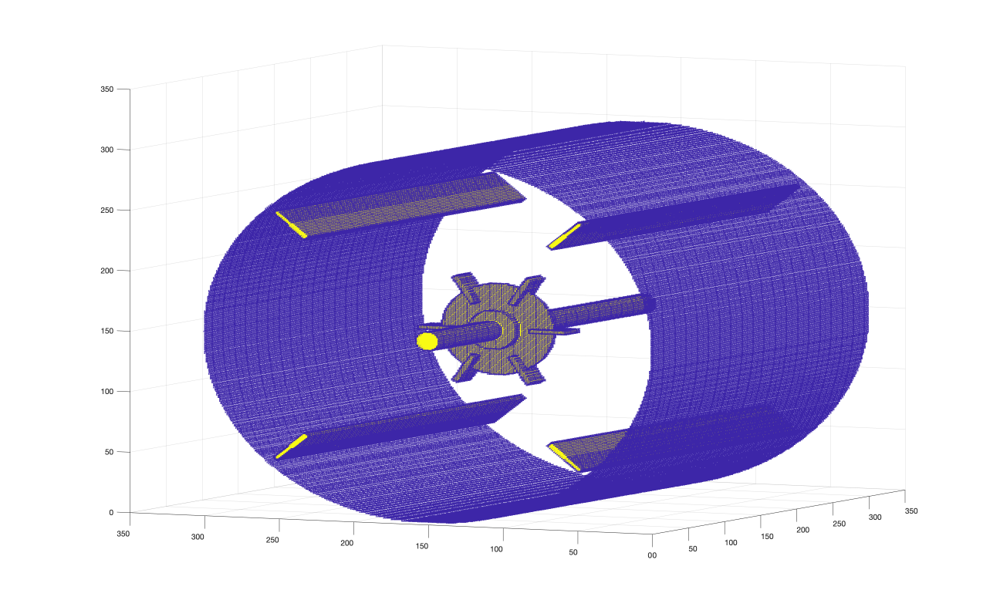

# Turbulent Dynamics Geometry Input Rushton Turbine
Application is part of a larger work to calculate a point cloud for a Rushton Turbine in an multi-node fluid dynamics code.  

[Graphical Frontend available here](https://turbulentdynamics.github.io/TD_GeomInput_Rushton_Turbine/WebGL)

## Install
```bash
cd rushton_turbine
cmake .
make
./td_rushton_test

octave display_rushton_geometry.m 
```

## Rushton produced from code


## Rushton Turbine Image


